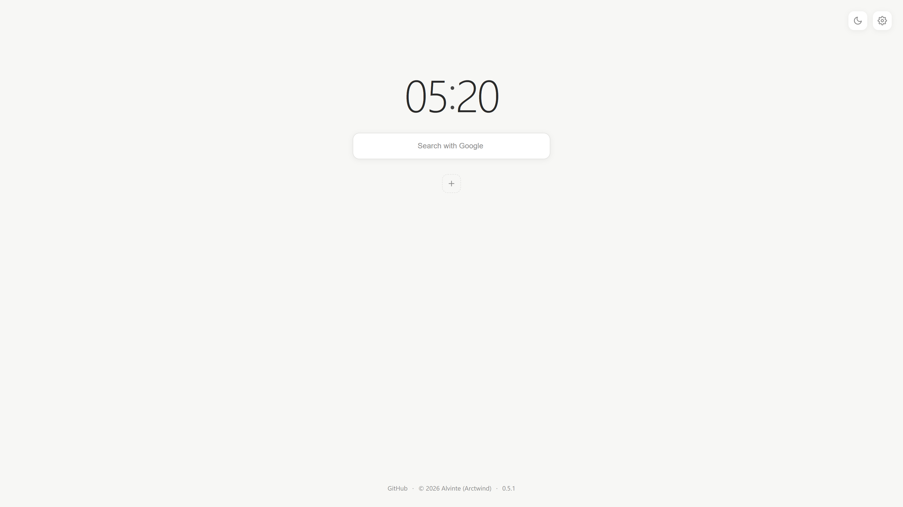
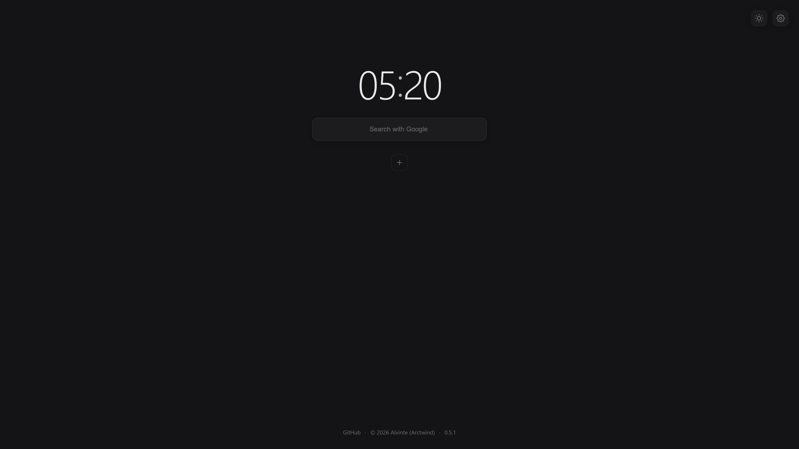

# Arwint

A personal browser start page.

[English](README.md) | [简体中文](README.zh-CN.md)

Arwint is a new-tab / start-page replacement for the browser.

Official site: [www.arwint.com](https://www.arwint.com)

## Preview

|                       Light                       |                      Dark                       |
| :------------------------------------------------: | :----------------------------------------------: |
|  |  |

## Sponsorship

如果你正在寻找云服务器，不妨试试雨云 —— 稳定可靠，性价比出色。注册时填写邀请码 **Alvinte** 可享优惠。

[www.rainyun.com](https://www.rainyun.com/Alvinte_)

## Tech stack

- Vite
- React
- TypeScript

## License

Licensed under the GNU Affero General Public License v3.0 (AGPL-3.0-only). See LICENSE for details.
